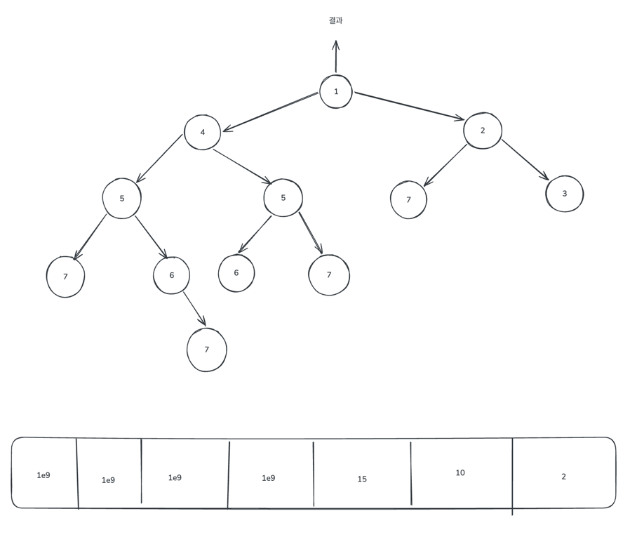

# 1. 시작
## 1.1. 문제
[퇴사](https://www.acmicpc.net/problem/14501)

## 1.2. 요구사항
- N+1일 째 되는 날 퇴사하려고 해서 남은 N일 동안 최대한 많은 상담을 하려고 한다.
- 하루에 하나의 상담만이 있고, 각 상담은 걸리는 시간(T)과 상담했을 때 받을 수 있는 금액(P)으로 이루어져 있다.
- 정수 N과 상담 스케줄 정보가 주어질 때, 퇴사 전에 받을 수 있는 최대 금액을 구하라.

## 1.3. 제약 조건
- 1 <= N <= 15
- 1 <= T <= 5, 1 <= P <= 1,000

## 1.4. 접근 방법
- 각 상담에 대해서 상담을 하거나, 하지 않는 모든 경우를 따진다. O(2^15)

## 1.5. Python 코드
```python
import sys

input = sys.stdin.readline

n = int(input().strip())
arr = [[] + list(map(int, input().strip().split())) for _ in range(n)]

answer = -1e9
def recurse(day, total_reward):
  if day >= n:
    global answer
    answer = max(answer, total_reward)
    return

  counsel = arr[day]
  duration, reward = counsel

  # day 날에 상담을 하는 경우
  if day + duration <= n:
    recurse(day + duration, total_reward + reward)

  # day 날에 상담을 하지 않는 경우
  recurse(day + 1, total_reward)

recurse(0, 0)
print(answer)
```

---

# 2. 탑다운 DP로 개선
## 2.1. 문제: [퇴사 2](https://www.acmicpc.net/problem/15486)

## 2.2. 요구사항
- 퇴사 1과 완전히 동일하다.

## 2.3. **제약 조건**
- **1 <= N <= 1,500,000**
- 1 <= T <= 50, 1 <= P <= 1,000

## 2.4. 접근 방법
- 퇴사 1처럼 재귀 함수로 모든 경우를 따진다. O(2^1500000)
- 메모이제이션 적용

## 2.5. Python 코드
```python
import sys

sys.setrecursionlimit(10 ** 9)
input = sys.stdin.readline

n = int(input().strip())
arr = [[] + list(map(int, input().strip().split())) for _ in range(n)]

memo = [-1e9] * n

# day번 째 날에 상담을 하거나, 하지 않는 모든 경우를 따졌을 때 얻을 수 있는 최대 total_reward를 구하는 메서드
def recurse(day):
    if day >= n:
        return 0
    if memo[day] != -1e9:
        return memo[day]

    duration, reward = arr[day]

    result = -1e9
    # day 날에 상담을 하는 경우
    if day + duration <= n:
        result = max(result, recurse(day + duration) + reward)

    # day 날에 상담을 하지 않는 경우
    result = max(result, recurse(day + 1))

    memo[day] = result
    return result

print(recurse(0))
```

## 2.6. 원리
- Brute-Force 방식의 메서드 시그니처: `recurse(day, total_reward)`
  - 과거에서부터 지금까지 얼마를 벌어왔는지 계속 가지고 다닌다.
- DP 방식의 메서드 시그니처: `recurse(day)`
  - 과거로부터 어떤 선택을 했는지는 중요하지 않다. 오직, 현재를 기준으로 앞으로 얼마를 더 벌 수 있는지가 관건이다.

각 날짜 별로, 과거에 어떤 선택을 했든 상관없이 앞으로 남은 날짜에 대해서는 얻을 수 있는 금액의 최대는 항상 같다.

DP의 조건
1. 겹치는 부분 문제
2. 최적 부분 구조



# 3. 탑다운 DP 유형 문제 리스트
| 문제 이름 | 난이도 | 링크 |
| :--- | :---: | :--- |
| 퇴사 2 | 골드 V | [15486번: 퇴사 2](https://www.acmicpc.net/problem/15486) |
| RGB거리 | 실버 I | [1149번: RGB거리](https://www.acmicpc.net/problem/1149) |
| 평범한 배낭 | 골드 V | [12865번: 평범한 배낭](https://www.acmicpc.net/problem/12865) |
| 공룡게임 | 실버 I | [20544번: 공룡게임](https://www.acmicpc.net/problem/20544) |
| 출근 경로 | 골드 IV | [5569번: 출근 경로](https://www.acmicpc.net/problem/5569) |
| 팰린드롬 만들기 | 골드 IV | [1695번: 팰린드롬 만들기](https://www.acmicpc.net/problem/1695) |
| 제곱수의 합 | 실버 II | [1699번: 제곱수의 합](https://www.acmicpc.net/problem/1699) |
| 파일 합치기 | 골드 III | [11066번: 파일 합치기](https://www.acmicpc.net/problem/11066) |
| 문자열과 점수 | 골드 III | [2216번: 문자열과 점수](https://www.acmicpc.net/problem/2216) |
| 라그랑주의 네 제곱수 정리 | 골드 V | [3933번: 라그랑주의 네 제곱수 정리](https://www.acmicpc.net/problem/3933) |
| 시간낭비 | 골드 III | [30464번: 시간낭비](https://www.acmicpc.net/problem/30464) |
| Walking Home | 실버 III | [23880번: Walking Home](https://www.acmicpc.net/problem/23880) |
| 팰린드롬? | 골드 IV | [10942번: 팰린드롬?](https://www.acmicpc.net/problem/10942) |
| 정수를 끝까지 외치자 | 골드 III | [25419번: 정수를 끝까지 외치자](https://www.acmicpc.net/problem/25419) |
| 나 퇴사임? | 골드 IV | [23831번: 나 퇴사임?](https://www.acmicpc.net/problem/23831) |
| 소형기관차 | 골드 III | [2616번: 소형기관차](https://www.acmicpc.net/problem/2616) |
| 구슬게임 | 골드 II | [2600번: 구슬게임](https://www.acmicpc.net/problem/2600) |
| 부분 문자열 뽑기 게임 | 골드 III | [1519번: 부분 문자열 뽑기 게임](https://www.acmicpc.net/problem/1519) |
| 욕심쟁이 판다 | 골드 III | [1937번: 욕심쟁이 판다](https://www.acmicpc.net/problem/1937) |
| 내리막 길 | 골드 III | [1520번: 내리막 길](https://www.acmicpc.net/problem/1520) |
