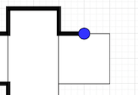

# 문제링크
https://school.programmers.co.kr/learn/courses/30/lessons/87694
# 30분내 어디까지 풀었는가
50분 걸려서 풀었지만 실패함
# 왜 못풀었는가 - 
### 풀이가 안떠올랐는지 / 어떻게 풀지는 알겠는데 구현을 못하겠다.

# 접근방법
1. 외각 을따라가는게 아닌 보드판을 만들어서 사각형의 좌표를 범위만큼 1로 표시해서 전체 덩어리를 만든다   

2. 위 사진과 같이 사각형이 겹치는면서 좌표가 1밖에 안나는경우  
    01 11      
    00 10      
    좌표가 이러할떄 보드판은  
    1 1  
    1 1  
    이렇게 된다 보드판상으로는 갈수있지만 사진 상으로 끓어진길이므로 갈수없다  
    이 엣지 케이스를 피하기위해 보드판 크기와 좌표를 *2를 해서 탐색을한다
3. 위와같은 이유로 보드판을 102 크기로 선언한다
4. 반복문을 통해 사각형 좌표 범위안으로 1을 채운다 -> 전체 덩어리진 블록이 나온다
5. 전체 더얼리진 블록에서 외각만남기기위해 외곽을 제외한 안쪽을 0 으로 바꾼다
   - ```java

     for (int y = y1 + 1; y < y2; y++) {
                    board[x][y] = 0;
                }
     ```
6. 시작 좌표와 목료좌표에 *2 를한후 bfs 를 통해 최단 거리를 구한다
7. 최단거리 / 2 를 해서 늘리지않은 거리를 반환한다
# 배운점 
처음에는 bfs 를써서 선을 따라갸야되겠다고 생각했지 보드판을 만들 생각을 하지못했다   
이번 문제를 통해 bfs로 풀때마다 문제를 보드판으로 만들어보는 시도를 해봐야곘다고 생각했다
